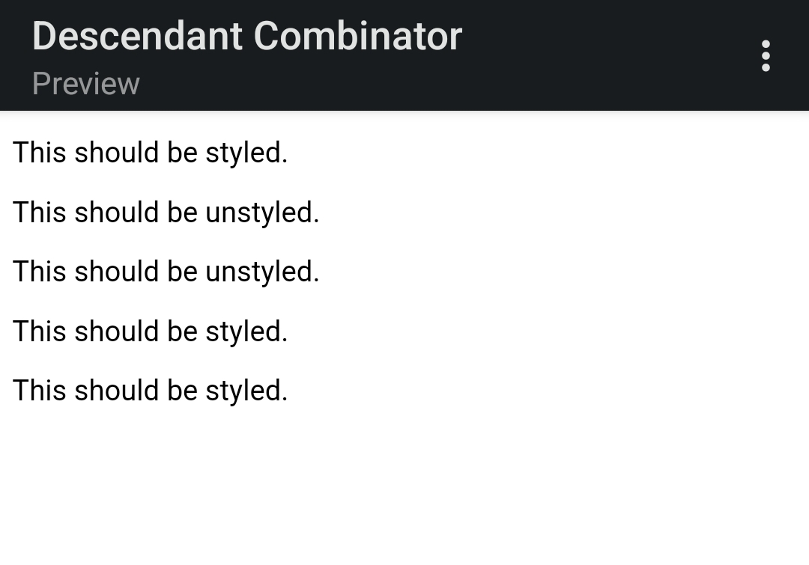
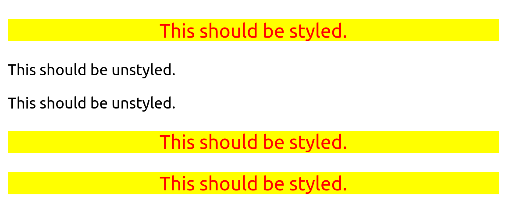

# Descendant Combinator
The goal of this exercise is to apply styles to elements that are descendants of another element, while leaving elements that *aren't* descendants of that element unstyled.

The properties added are:

* Only the `p` elements that are descendants of the `div` element should have a yellow background, red text, a font size of 20px, and center aligned.

## Initial

## Desired Outcome

